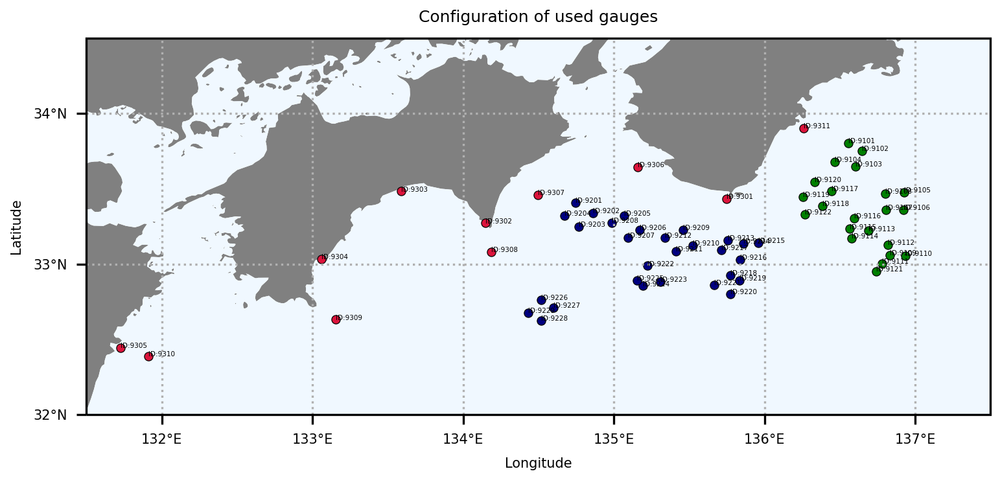
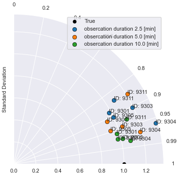
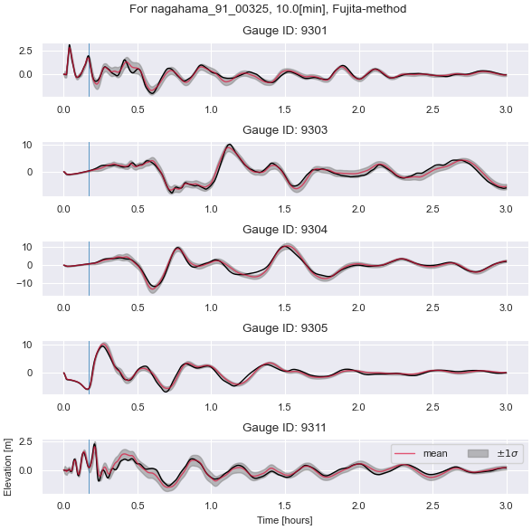
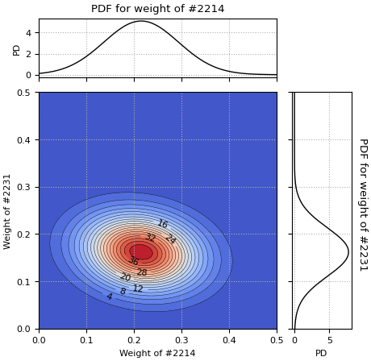

# Bayesian tsunami forecasting

## 格納ファイルの説明

```terminal
.
├── README.md
├── data              ：入力データを格納．ただし容量の問題からGitでは管理しない．
│   ├── case_ID.csv   ：地震シナリオの番号を格納．
│   ├── gauge_loc.csv ：観測点の位置情報を格納．
│   └── wave_seq.npy  ：波高データを格納したバイナリファイル．形状は（シナリオ数，観測点数，時間ステップ数）．
└── script            ：計算用のスクリプト（Python）．
    ├── COND.yaml     ：`MAIN.py`実行のための計算条件を設定．
    ├── FORECAST.py   ：津波予測用のスクリプト．旧手法（Nomura et al.: Sequential Bayesian update）と新手法の切り替えが可能．
    ├── MAIN.py       ：`PRE.py`と`FORECAST.py`を実行するためのスクリプト．
    ├── PRE.py        ：前処理（データ読み込み・分割，POD）のためのスクリプト．
    └── subfigure.py  ：地形図（cartopy）を描画するための副プログラム．
```

使用したパッケージとバージョン．
|Libraries|Versions|
|:---|:---:|
|python|3.8.10|
|numpy|1.22.1|
|simplekml|1.3.6|
|cupy|12.3.0|
|pandas|1.3.5|
|dask|2022.5.0|
|seaborn|0.11.2|
|scipy|1.8.1|
|cartopy|0.18.0|

## 使用方法

~~計算の実行等は`README.md`が置かれている階層で行うことが前提．~~
~~例えば，`./script/`下での計算実行はエラーとなるので注意．~~
~~以下の説明においても，カレントディレクトリは本リポジトリをクローンした際に生成される`bayesian_tsunami_forecasting/`下とする．~~

### 準備

<!-- 本リポジトリのクローン後，orcaからdataディレクトリを取得・解凍する． -->

本データはGeoClawにより作成した2400の仮想南海トラフ地震・津波シナリオから一部シナリオを抜粋したものである．
具体的には2342シナリオの，62観測点（下記参照）における波高データのみを使用している．
シナリオに関しては，シミュレーションが正しく実施されていないと思われる58件を除いた結果であり，観測点については実観測点と同位置のものを採用している．観測点配置は以下であり，[NOWPHAS](https://www.mlit.go.jp/kowan/nowphas/ "リアルタイムナウファス（国土交通省港湾局，全国港湾海洋波浪情報網）")（赤丸），[DONET1](https://www.seafloor.bosai.go.jp/DONET/ "地震・津波観測監視システム：DONET")（青丸），[DONET2](https://www.seafloor.bosai.go.jp/DONET/ "地震・津波観測監視システム：DONET")（緑丸）を参照にした配置となっている．



### MAIN.pyの実行

`script/COND.yaml`で計算条件を設定し，`script/MAIN.py`を実行することにより`script/PRE.py`と`script/FORECAST.py`が実行される．それぞれのプログラムを個別に実行することも可能である．

#### `script/COND.yaml`: 計算条件の設定

- `GPU`: *bool*　GPUを使用するかどうかの設定．基本的にはGPUを使用したほうが計算が早い（はず）．参考までにDLBOX君では，予測計算にかかる時間が数分⇒数秒くらいの差はある．
- `cv`: *int*　使用するクロスバリデーションセットのID．デフォルトでは全データが4分割され，そのうちの1つをテストシナリオとするため，`cv`は0～３で設定する．分割数は`ncv_set`により決定される．
- `inp_dir`: *str*　入力ファイルを格納するディレクトリ名．
- `res_dir`: *str*　出力ファイルを格納するディレクトリ名．
- `fwave`: *str*　波高時系列データを格納するファイル名．`inp_dir`内に同名のファイルが必要．
- `fgauge`: *str*　観測点位置データを格納するファイル名．`inp_dir`内に同名のファイルが必要．
- `fcase`: *str*　シナリオ名を格納するファイル名．`inp_dir`内に同名のファイルが必要．
- `ftrain`: *str*　学習データを格納するファイル名．`res_dir`内に同名のファイルが出力される．
- `ftest`: *str*　学習データを格納するファイル名．`res_dir`内に同名のファイルが出力される．
- `fttlist`: *str*　学習データとテストシナリオの分類結果を格納するファイル名．`res_dir`内に同名のファイルが出力される．
- `fu`: *str*　空間モード行列を格納するファイル名．`res_dir`内に同名のファイルが出力される．
- `fs`: *str*　特異値を格納するファイル名．`res_dir`内に同名のファイルが出力される．
- `ncv_set`: *int*　クロスバリデーションのためのデータ分割数．
- `nsce`, `ntim`, and `ngag`: *int*　シナリオ数，時間ステップ数，観測点数
- `ver`: *str*　予測手法の選択．
- `ROM`: *bool　予測計算時に特異値分解による次元削減を行うかどうかを決定．`false`の場合はPOD係数を介さずに波高データを直接比較することで予測を行う．
- `nmod`: *int*　ROM時の使用モード数．
- `ltest`: *[int]*　予測計算の対象テストシナリオID．
- `obs_window`: *[int]*　予測結果を出力する観測時間ステップ．

#### 計算の実行
MAIN.py内で以下の条件設定を行い，プログラムを実行する．

- `preproc`: *bool*　前処理を実行するかどうか．
- `forecast`: *bool*　予測計算を実行するかどうか．

```terminal
python3 script/MAIN.py
```

#### 実行結果
MAIN.pyを実行後，PRE.pyとFORECAST.pyが実行され以下のようなログが流れる．

```terminal
$ python3 script/MAIN.py 
2024-02-29 20:34:47.103142
###  Preprocessing  ###
  - Initialization for preprocessing
  - Make figure for gauge arrangement (PNG)
  - Split data into training and test set
    Shape of training data (training scenarios, gauges, time steps):
      (1756, 62, 2160)
    Shape of test data (test scenarios, gauges, time steps):
      (586, 62, 2160)
  - sigular value decomposition for reduced-order modeling
    Shape of POD mode matrix (modes, modes):
      (62, 62)
    Shape of singular value vector (modes):
      (62,)
  - Make figure for contribution rates of singular values
  - Make figure for reconstruction errors vs used POD modes
2024-02-29 20:35:10.879646 

###  Forecasting  ###

2024-02-29 20:35:10.887076
Calculation starting with Fujita-version
With ROM via SVD using top 23 modes
Forecasting for scenario No.561 ("nagahama_91_00325")
  - Prediction Step: 0=0.0[min] for nagahama_91_00325
    Probable scenarios: ['nagahama_87_00328' 'nagahama_91_00026' 'nagahama_89_00156']
    weights : [0.00254603 0.00206278 0.0020399 ]
  - Prediction Step: 60=5.0[min] for nagahama_91_00325
    Probable scenarios: ['nagahama_91_00255' 'nagahama_91_00275' 'nagahama_91_00080']
    weights : [0.14705409 0.1397648  0.1067408 ]
  - Prediction Step: 120=10.0[min] for nagahama_91_00325
    Probable scenarios: ['nagahama_91_00255' 'nagahama_91_00275' 'nagahama_91_00080']
    weights : [0.21509331 0.1618069  0.15432459]
Calculation ending at 2024-02-29 20:35:16.249933
Make a waveform figure for No.561
Make a Taylor diagram for No.561
Make a figure of PDF for No.561
$ 
```

また，初期設定では以下のような予測計算結果の図が`/result/`内に描画される．

  |Taylor diagram|波形予測図（観測時間150s & 300s）|重みパラメータ分布|
  |:---:|:---:|:---:|
  |||
